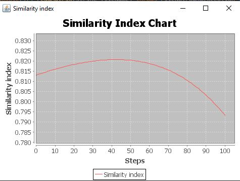
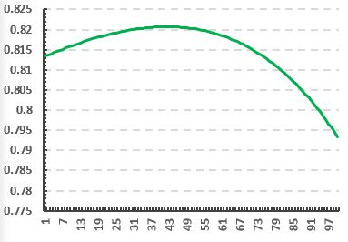

Laurentiu Tanase 1241F

An implementation after Paul A. Gagniuc et al. Spectral Forecast: A general purpose prediction model as an alternative to classical neural networks.  Chaos 30, 033119 (2020); doi: 10.1063/1.5120818 
https://aip.scitation.org/doi/pdf/10.1063/1.5120818

This project gets 3 matrices as input in the resources folder (matrixA and matrixB as sample from a healthy and a non-healthy patients and matrix P as sample from a patient) and outputs a similarity index between the matrix sample from a patient and the other samples. 
The output is shown as values in the console and a plot. 

The computation is based on the equations from the article above. 